# Zalo Photos Assignment 2026

> Note: This isn't a traditional scientific report format. **I wrote this as a story**, focusing on the why behind the architecture, the real-world trade-offs, and the actual value delivered. **I manually bold information that are important.** I hope you enjoy the read!

## 0. Executive memo: what the data says, what I chose, and why it is the safest 3-day decision

**The Problem**: While the benchmark expects a clean single-label classification, the real-world dataset is tiny (~300 samples) and inherently constrained by semantic ambiguity and label noise.

**The Decision**: I implemented a data-centric pipeline utilizing a frozen CLIP-family encoder (SigLIP2) combined with an offline noise-weighted linear head, handling the "other" class as a reject-style residual outcome.

**Why It Matters**: For a tiny dataset with highly ambiguous boundaries, complex modeling risks overfitting to label noise. A data-centric approach with frozen priors maximizes 3-day ROI by establishing a stable, reproducible baseline while exposing underlying data ambiguities.

**Key Metrics & Data Realities:**

- Dataset & Data Quality: The raw dataset contains 321 images (261 train, 60 test). After removing 10 leaky test samples, the clean evaluation set contains 50 images.
- Final Performance: Achieved a 0.8213 Macro-F1 and 0.8611 Balanced Accuracy.
- Core Confusion: The primary source of error is the "other" class; because it acts as a heterogeneous catch-all, it frequently overlaps with specific semantic clusters (e.g., visually festive "other" images confidently misclassified as lunar_new_year).

## Act I: Let the data speak first

The benchmark looks simple on the surface, but the underlying data tells a different story. Initial explorations revealed that the true challenge is not model capacity, but rather label ambiguity, residual classes, data leakage, and a tiny sample size.

### 1. What the benchmark asks

At first glance, the task is straightforward:

- Task: Single-label, 6-class image classification (`baby_playing`, `lunar_new_year`, `nature`, `trekking`, `gathering`, and `other`).

- Constraint: A strict 3-day timeline; heavy LLMs or VLMs are prohibited.

- Metric: Macro-F1 (primary) to account for class representation, and Balanced Accuracy (secondary).

### 2. Patterns, outliers, and data quality issues

Prioritizing data over model capacity, EDA reveals this isn't a simple classification task. We are navigating a data-constrained regime (~320 images) riddled with collection artifacts and composition quirks.

**Table 1:** Raw train/test class distribution

| Category | train | test | total | train_pct | test_pct |
| --- | --- | --- | --- | --- | --- |
| **baby_playing** | 39 | 9 | 48 | 14.9% | 15.0% |
| **gathering** | 24 | 5 | 29 | 9.2% | 8.3% |
| **lunar_new_year** | 32 | 7 | 39 | 12.3% | 11.7% |
| **nature** | 60 | 14 | 74 | 23.0% | 23.3% |
| **other** | 66 | 16 | 82 | 25.3% | 26.7% |
| **trekking** | 40 | 9 | 49 | 15.3% | 15.0% |

Beyond imbalance, the dataset contains critical structural flaws:

- Duplicates & Leakage: [C-RADIOv4](https://arxiv.org/abs/2601.17237) embeddings revealed 5 duplicates and 10 leaky samples across the train-test split. Without correction, this leakage would artificially inflate scores, creating a false sense of generalization.
- Semantic Overlap: There is severe semantic overlap between classes like trekking vs. nature (thiên nhiên), and lunar_new_year (ngày_tết) vs. gathering (tụ_họp).

**Table 2:** Short summary table of exact dup / near dup / leaky test

| Category | Count | Percentage | Note |
| --- | --- | --- | --- |
| Exact Duplicates | 14 | 4.4% | File hash match (MD5/SHA) |
| Near Duplicates | 17 | 5.3% | C-RADIOv4, threshold=0.1 |
| Leaky Test Samples | 10 | 16.7%* | Test samples too similar to Train (Data Leakage) |

| `data_train/tụ_họp_verified/0346_d79805bc0361.png` | `data_test/ngày_tết_verified/0346_d79805bc0361.png` |
| :---: | :---: |
|  |  |

**Image 1:** Demonstrating a Leaky Split. This example also illustrates Semantic Ambiguity (e.g., an image perfectly fitting both `gathering` and `lunar_new_year`)

These patterns change the problem. The goal is no longer about picking the strongest classifier, but designing the safest decision rule for messy, overlapping data.

### 3. Why the obvious closed-set mental model breaks

Treating this as a mutually exclusive 6-class problem optimizes for the wrong outcome. A strict single-label classifier breaks down here for two core reasons:

- **The `other` class is a residual:** It is not a compact semantic cluster but a heterogeneous catch-all. Forcing standard softmax classification forces the model to guess, often confidently misclassifying visually festive `other` images as `lunar_new_year`.
- **Forced single-choice is unrealistic:** In real-world products, an image often belongs to multiple categories at once. For example, a photo of a family dinner is both gathering and lunar_new_year. Forcing a standard model to pick only one label forces it to make arbitrary, confusing guesses.

> **The Takeaway:** The real problem is not "training the strongest model," but "designing a decision rule that safely handles noisy, ambiguous data and a heterogeneous residual class."

## Act II: Reframing the problem in product context

### 4. Task reframing: from clean classification to ambiguity-aware decision-making

- While the final output must remain strictly single-label to satisfy the benchmark, training and error analysis must embrace the dataset's inherent ambiguity. The problem is practically **semantic retrieval + calibrated decision-making** rather than plain closed-set classification.
- `other` is a residual, not a concept: Instead of treating `other` as a compact semantic cluster, it is modeled as a reject-style outcome for out-of-distribution or ambiguous samples.

### 5. Design principles under a 3-day constraint

- Prefer strong pretrained representations over end-to-end tuning. In a severely constrained dataset, establishing a stable feature space for photo tagging is much safer than risking overfitting.
- Let actual data realities (semantic overlap between tags) dictate model and loss design. Data-centric fixes yield a higher ROI than architectural complexity.
- Treat uncertainty, and failure analysis as core features. The 3-day goal is to deliver a reproducible, robust tagging logic, rather than a brittle model over-engineered solely for a leaderboard.

### 6. Why this method fits the data, the constraint, and the product context

| Component | Rationale for Selection |
| --- | --- |
| [SigLIP2](https://arxiv.org/abs/2502.14786) | **Semantic overlap and multilingual cues** matter more here than purely vision-focused features e.g. [DINOv3](https://arxiv.org/abs/2508.10104).|
| [CLIPCleaner](https://github.com/MrChenFeng/CLIPCleaner_ACMMM2024) | Hard filtering is too destructive for a ~300-sample dataset. Soft weighting mitigates label noise without sacrificing critical data mass. |
| **K-fold / OOF** | A single validation split on tiny data yields highly unstable metrics. Out-of-fold scoring ensures robust, reliable model selection. |
| **Linear head** | Stable, low-variance decision boundary on top of frozen embeddings, maximizing the 3-day ROI while remaining fully reproducible and easy to calibrate. |

## Act III: The chosen system

### 7. Overview

**Mermaid diagram**: Data audit → denoise/weight → embedding extraction → decision rule / head → calibration → failure analysis

```mermaid
flowchart LR
    %% 1. Data Audit
    subgraph Data_Audit ["1. Data Audit"]
        A1[Bronze Dataset] --> A2(Exact Duplicates<br/>MD5/SHA)
        A2 --> A3(Near Duplicates & Leakage<br/>C-RADIOv4 Index)
        A3 --> A4(Uniqueness & Representativeness)
    end

    %% 2. Denoise / Weight
    subgraph Denoise_Weight ["2. Denoise / Weight"]
        A4 --> B1(CLIPCleaner<br/>Zero-shot Semantic Scoring)
        B1 --> B2(Soft Weighting<br/>Mitigate Label Noise)
        B2 --> B3[Silver / Gold Dataset]
    end

    %% 3. Embedding Extraction
    subgraph Embedding_Extraction ["3. Embedding Extraction"]
        B3 --> C1(Frozen Pretrained Backbone<br/>SigLIP2-so400m-patch16-384)
        C1 --> C2(1152-dim Dense Embeddings)
    end

    %% 4. Decision Rule / Head
    subgraph Decision_Rule ["4. Decision Rule / Head"]
        C2 --> D1(Stratified 5-Fold CV)
        D1 --> D2(Linear Classification Head<br/>PyTorch nn.Linear)
        D2 --> D3(Class-Weighted & Sample-Weighted Loss<br/>Label Smoothing)
    end

    %% 5. Failure Analysis
    subgraph Failure_Analysis ["5. Failure Analysis"]
        D3 --> F1(FiftyOne Evaluation<br/>Classifications, Confusion Matrix)
        F1 --> F2(Error Triage<br/>Semantic Ambiguity, Label Noise, Visual Outlier)
        F2 --> F3(MLflow / DagsHub Tracking<br/>F1, Balanced Accuracy)
    end

    classDef stage fill:#f9f9f9,stroke:#333,stroke-width:2px;
    class A1,B3 stage;
```

### 8. Representation choice: SigLIP2 Backbone

When dealing with a tiny and noisy dataset, representation quality is far more critical than end-to-end model capacity. Investing in a robust, pre-aligned feature space yields a higher return than blindly optimizing a complex model.

#### Why SigLIP2?

The core system uses frozen [google/siglip2-so400m-patch16-384](https://huggingface.co/google/siglip2-so400m-patch16-384) image embeddings. The so400m-patch16-384 variant was specifically selected because its static input resolution (384x384 rather than NaFlex) captures the fine-grained visual details necessary to disambiguate overlapping classes, while remaining lightweight enough to process rapidly within a strict 3-day constraint.

#### Why NOT other state-of-the-art representations?

- [DINOv3](https://github.com/facebookresearch/dinov3) and [C-RADIOv4](https://github.com/NVlabs/RADIO): excels at dense, purely vision-focused features (e.g., object boundaries, pixel-level details), the primary bottleneck in this dataset is *semantic ambiguity* (e.g., visually separating a general `gathering` from a `lunar_new_year` dinner). SigLIP2's contrastive image-text alignment is explicitly designed to separate high-level abstract concepts, making it far more suitable than a vision-only encoder.
- [MetaCLIP2](https://github.com/facebookresearch/MetaCLIP/blob/main/docs/metaclip2.md): The dataset's raw labels and underlying concepts are deeply tied to Vietnamese cultural contexts (e.g., "ngày_tết", "tụ_họp"). SigLIP2 demonstrates highly robust multilingual text-to-image priors, providing a much more accurate zero-shot baseline for these specific non-English cues out of the box.
- [NAVER ProLIP](https://github.com/naver-ai/prolip): While ProLIP's probabilistic modeling is *theoretically ideal for handling ambiguous boundaries and many-to-many relationships*, fine-tuning its complex projector layers on merely ~260 noisy training samples within a strict 3-day window introduces an unacceptable risk of overfitting.

### 9. Data-centric supervision: CLIPCleaner

[CLIPCleaner: Cleaning Noisy Labels with CLIP](https://arxiv.org/abs/2408.10012)

Hard filtering is too destructive for a dataset of only ~300 samples. Instead of aggressively deleting suspicious samples, I use semantic scoring to down-weight likely noisy or ambiguous examples. This preserves scarce signal while reducing gradient damage from mislabeled data.

To avoid the self-confirmation bias typical of standard confident-learning approaches, I implemented a soft-weighting pipeline inspired by [CLIPCleaner](https://github.com/MrChenFeng/CLIPCleaner_ACMMM2024). The sample reliability (`clean_score`) is derived by blending two independent signals:

1. **Zero-shot Semantic Scoring:** A frozen SigLIP2 model evaluates image-text alignment using a bilingual prompt bank (English/Vietnamese) before any training occurs.
2. **Out-of-Fold (OOF) Logistic Regression:** A lightweight linear classifier trained via a safe 5-fold cross-validation strategy on the visual features, ensuring the model does not score the same data it trained on.

By combining these signals ($\alpha=0.4$), the resulting score is applied as a loss weight. Ambiguous samples exert less pull on the gradient, allowing the model to learn stable class boundaries without artificially shrinking the training volume.

**Image 2:** CLIPCleaner-derived clean scores across classes. The `other` class shows the widest variance, confirming that it is the noisiest and least coherent semantic group, while `unlabeled` samples collapse near zero as expected.

**Image 3:** FiftyOne visualization of CLIPCleaner score sorted by clean_score (pink, loss weights), comparing ground_truth (green), zero-shot SigLIP2 predictions (dark blue), and the fine-tuned (cyan) to identify ambiguous samples.

### 10. Why `other` is handled as a reject-style outcome

Conceptually, `other` behaves like a residual class, even though the current implementation still uses a standard supervised head.

**Table 3:** Confusion matrix on the *clean evaluation* set after removing leaky test images

| GT \ Pred | baby_playing | gathering | lunar_new_year | nature | other | trekking | Total |
| :--- | :---: | :---: | :---: | :---: | :---: | :---: | :---: |
| baby_playing | 5 | 0 | 0 | 0 | 1 | 0 | 6 |
| gathering | 0 | 4 | 1 | 0 | 0 | 0 | 5 |
| lunar_new_year | 0 | 0 | 5 | 0 | 0 | 0 | 5 |
| nature | 0 | 0 | 0 | 11 | 0 | 0 | 11 |
| other | 0 | 2 | 5 | 0 | 8 | 0 | 15 |
| trekking | 0 | 0 | 0 | 0 | 0 | 8 | 8 |
| Total | 5 | 6 | 11 | 11 | 9 | 8 | 50 |

**Table 4:** Per-class performance on the *clean evaluation set*

| Category | Precision | Recall | F1-Score | Support |
| :--- | :--- | :--- | :--- | :--- |
| baby_playing | 1.000 | 0.833 | 0.909 | 6 |
| gathering | 0.667 | 0.800 | 0.727 | 5 |
| lunar_new_year | 0.455 | 1.000 | 0.625 | 5 |
| nature | 1.000 | 1.000 | 1.000 | 11 |
| other | 0.889 | *0.533* | 0.667 | 15 |
| trekking | 1.000 | 1.000 | 1.000 | 8 |
| Macro Avg | **0.835** | **0.861** | **0.821** | 50 |

Because the `other` class acts as a heterogeneous catch-all, its recall is inherently weaker (0.53). As shown in the evaluation reports, high-confidence errors heavily skew toward `other` spilling over into the `lunar_new_year` and `gathering` classes, simply because festive decorative elements or social contexts trigger strong visual signals. Treating `other` strictly as a margin-based rejection acknowledges this ambiguity rather than forcing the model to guess.

## Act IV: Evidence for the decision

Instead of an exhaustive log of experiments, the following metrics and visual cues serve as targeted evidence. They demonstrate why the chosen decision framework is a more reliable approach for this specific data reality.

### 11. Evidence block A: Data evidence

The structural flaws of the dataset dictate the modeling strategy. As previously outlined, **Table 1** (Class Distribution) and **Table 2** (Duplicates & Leakage) establish the severe constraints and noise present in the raw data. Furthermore, **Image 1** highlights the data leakage and semantic ambiguity natively present across splits.

To visually anchor this ambiguity:

**Image 4**: FiftyOne visualization of embedding neighborhood, highlighting the severe semantic overlap between classes like `gathering` and `lunar_new_year`.

This overlap confirms that relying purely on visual boundaries is insufficient; the model requires a strong, pre-aligned semantic prior over complex visual modeling.

### 12. Evidence block B: Decision evidence

The core philosophy is "less is more": establishing a stable baseline and introducing complexity only where it directly addresses a dataset flaw.

As detailed in **Table 3** (Confusion Matrix) and **Table 4** (Per-class Performance), the supervised linear head effectively maps the frozen representations to the task constraints, achieving perfect recall on distinct classes (`nature`, `trekking`) while intentionally treating `other` as a calibrated rejection margin.

**Table 5:** Zero-shot Baseline vs. Main System and Targeted Ablations

| Configuration | Macro-F1 | Balanced Acc | Key Takeaway |
| :--- | :---: | :---: | :--- |
| Baseline: Zero-shot SigLIP2 | 0.8078 | 0.8657 | Strong semantic prior, but struggles with specific task boundaries. |
| Ablation: Single Validation Split - [MLflow](https://dagshub.com/cykanp/zalo-photos-assignment-2026.mlflow/#/experiments/4/runs?searchFilter=&orderByKey=attributes.start_time&orderByAsc=false&startTime=ALL&lifecycleFilter=Active&modelVersionFilter=All+Runs&datasetsFilter=W10%3D) | 0.7965 | 0.8570 | High variance; proves K-fold CV is strictly necessary for tiny data. |
| Ablation: Without CLIPCleaner weighting - [MLflow](https://dagshub.com/cykanp/zalo-photos-assignment-2026.mlflow/#/experiments/3/runs?searchFilter=&orderByKey=attributes.start_time&orderByAsc=false&startTime=ALL&lifecycleFilter=Active&modelVersionFilter=All+Runs&datasetsFilter=W10%3D) | **0.8406** | **0.8682** | Removing CLIPCleaner weighting slightly improved scores here, suggesting soft weighting may be overly conservative for tiny data. |
| **Main System:** Frozen SigLIP2 + Weighted Linear Head - [MLflow](https://dagshub.com/cykanp/zalo-photos-assignment-2026.mlflow/#/experiments/1/runs?searchFilter=&orderByKey=attributes.start_time&orderByAsc=false&startTime=ALL&lifecycleFilter=Active&modelVersionFilter=All+Runs&datasetsFilter=W10%3D) | *0.8213* | *0.8611* | Final system: selected for robustness to noisy labels over peak scores on this small evaluation set. |

#### Ablation: Single Validation Split

To measure how unstable a traditional **single validation split** can be on this tiny dataset, I simulated five runs where each split was used once as the validation set.

| Simulated Split | Macro-F1 | Balanced Acc |
| :--- | :---: | :---: |
| Split 0 as validation | 0.8213 | 0.8778 |
| Split 1 as validation | 0.7568 | 0.8444 |
| Split 2 as validation | 0.7869 | 0.8348 |
| Split 3 as validation | 0.7991 | 0.8500 |
| Split 4 as validation | 0.8186 | 0.8778 |
| **Mean ± Std** | 0.7965 ± 0.0236 | 0.8570 ± 0.0177 |
| **Max - Min** | 0.0646 (6.46%) | 0.0430 (4.30%) |

This ablation shows that if we rely on only one validation split, the reported performance can vary heavily depending on the initial data partition. In practice, the true Macro-F1 could fall anywhere between 0.7568 and 0.8213, a gap of 6.46%.

For a dataset this small and noisy (<300 samples), a single split is therefore not reliable and introduces high variance. **This is exactly why K-fold cross-validation is necessary**: it provides a more stable and trustworthy estimate of whether the model truly generalizes across different regions of the data.

#### Ablation: Without CLIPCleaner weighting

Surprisingly, **the model without CLIPCleaner weighting performed slightly better** on the clean evaluation set (+1.9% Macro-F1). This suggests that for this specific tiny dataset (~260 samples), preserving the full gradient pull of every sample, even potentially noisy ones, might provide more "mass" for the linear head to define its boundaries, whereas soft-weighting might be slightly too conservative.

CLIPCleaner was motivated as a safer noise-aware strategy, although on this very small clean evaluation set it did not improve the final score.

### 13. Failure modes, limitations, and evaluation context

The pipeline is designed to make failure modes easy to inspect, even when the classifier is overconfident on ambiguous cases.

**Image 5:** Top high-confidence errors showcasing severe semantic overlap.

The high-confidence errors are **not random**. They mostly happen between classes that look very similar, especially `gathering` and `lunar_new_year`. These images often contain the same visual cues, such as groups of people, food, and indoor meals.

The `other` class causes the most trouble. It is a **catch-all class**, so it does not have one clear meaning. Because of that, when an `other` image contains strong cues like red decorations or festive scenes, the model often pushes it into a more specific class such as `lunar_new_year` with very high confidence. This shows a **bias in the single-label setup**, not a failure of the visual features.

#### Specific failure cases analysis

Image 7: no_baby.png (GT: other, Pred: baby_playing). The model over-associates toys with playing babies, ignoring the absence of an actual subject.

Image 8: style_cartoon.png (GT: other, Pred: lunar_new_year). The model relies heavily on semantic cues (lanterns, family) and ignores the domain shift from real photos to graphics.

Overall, these errors suggest that the dataset is closer to a **multi-label problem** than a strict single-label problem. A hard one-label decision is therefore not ideal. Better options would be **soft-label or multi-label training**, or at least **giving lower weight to ambiguous samples** during training.

### System Limitations

- Sample Size Constraints: 50-sample evaluation set is too small to claim absolute statistical significance; metrics serve as directional indicators rather than absolute capabilities.
- Inherent Ambiguity: Real-world photo tagging is inherently multi-label. Forcing single-label metrics on ambiguous images penalizes the model for capturing valid secondary semantics.

### 14. Implementation and analysis discipline

Executing this within a 3-day constraint required strict engineering discipline, transitioning the workflow from ad-hoc notebooks to an auditable pipeline.

- [FiftyOne](https://docs.voxel51.com/) for EDA: the primary data layer for duplicate discovery, embedding visualization, and failure triage. It ensured that qualitative errors were systematically tagged rather than manually guessed.
- [Hugging Face Transformers](https://huggingface.co/docs/transformers/index): Chosen over [open_clip](https://github.com/mlfoundations/open_clip) to minimize experimentation friction. For a tightly scoped 6-class task, heavy reliance on prompt engineering (open_clip's zero-shot classification with [`OPENAI_IMAGENET_TEMPLATES`](https://github.com/mlfoundations/open_clip/blob/main/src/open_clip/zero_shot_metadata.py)) can add noise rather than improve performance. Transformers provides a cleaner, more reproducible pipeline for extracting raw embeddings for the linear head, with greater flexibility and less boilerplate.
- [DagsHub MLflow](https://dagshub.com/docs/integration_guide/mlflow_tracking/) for experiment tracking: ensured full reproducibility of metrics, models, and artifacts (like confusion matrices).
- **AI-Assisted Workflow:** AI agents were utilized for code scaffolding and research ideation, accelerating the engineering cycle while ensuring all analytical decisions remained strictly verified, auditable, and data-driven.

## Reflections and Future Directions

## Lessons Learned

Three lessons stood out during this project.

1. First, evaluation metrics should be defined early so that all ablations are compared under the same standard.
1. Second, the project scope should also be defined early, because it strongly affects which model, training strategy, and trade-offs are worth choosing within a short timeline, and which ideas should be left for later work.
1. Third, careful data analysis is essential: it not only reveals label noise and semantic overlap, but also prevents important failure modes such as out-of-domain and style-based errors from being missed.

## Future Work

- Use ambiguity-aware models such as [ProLIP](<https://github.com/astra-vision/Proramework> may handle overlapping classes better than a hard single-label setup.
- Make `other` an explicit residual class: Instead of learning `other` as a regular class, predict it only when no specific class is confident enough.
- Handle out-of-domain and style-based errors more explicitly: Future work should address cases such as toys vs. real babies, or illustrations vs. real photos, using style augmentation, style-aware modeling, or negative prompts.
