# Zalo Photos Assignment 2026

## 0. Executive memo: what the data says, what I chose, and why it is the safest 3-day decision

**The Problem**: While the benchmark expects a clean single-label classification, the real-world dataset is tiny (~300 samples) and inherently constrained by semantic ambiguity and label noise.

**The Decision**: I implemented a data-centric pipeline utilizing a frozen CLIP-family encoder (SigLIP2) combined with an offline noise-weighted linear head, handling the "other" class as a reject-style residual outcome.

**Why It Matters**: For a tiny dataset with highly ambiguous boundaries, complex modeling risks overfitting to label noise. A data-centric approach with frozen priors maximizes 3-day ROI by establishing a stable, reproducible baseline while exposing underlying data ambiguities.

**Key Metrics & Data Realities:**

- Dataset Constraints: ~261 training samples and 50 clean evaluation samples.
- Data Quality Issues: Identified and handled 5 duplicate/near-duplicate images and 10 leaky samples across the train/test splits.
- Final Performance: Achieved a 0.8213 Macro-F1 and 0.8611 Balanced Accuracy.
- Core Confusion: The primary source of error is the "other" class; because it acts as a heterogeneous catch-all, it frequently overlaps with specific semantic clusters (e.g., visually festive "other" images confidently misclassified as lunar_new_year).

## Act I: Let the data speak first

The benchmark looks simple on the surface, but the underlying data tells a different story. Initial explorations revealed that the true challenge is not model capacity, but rather label ambiguity, residual classes, data leakage, and a tiny sample size.

### 1. What the benchmark asks

At first glance, the task is straightforward:

- Task: Single-label, 6-class image classification (`baby_playing`, `lunar_new_year`, `nature`, `trekking`, `gathering`, and `other`).

- Constraint: A strict 3-day timeline; heavy LLMs or VLMs are prohibited.

- Metric: Macro-F1 (primary) to account for class representation, and Balanced Accuracy (secondary).

### 2. Patterns, outliers, and data quality issues

Prioritizing data over model capacity, EDA reveals this isn't a simple classification task. We are navigating a data-constrained regime (~320 images) riddled with collection artifacts and composition quirks.

**Table 1:** train/test class distribution

| Category | train | test | total | train_pct | test_pct |
| --- | --- | --- | --- | --- | --- |
| **baby_playing** | 39 | 9 | 48 | 14.9% | 15.0% |
| **gathering** | 24 | 5 | 29 | 9.2% | 8.3% |
| **lunar_new_year** | 32 | 7 | 39 | 12.3% | 11.7% |
| **nature** | 60 | 14 | 74 | 23.0% | 23.3% |
| **other** | 66 | 16 | 82 | 25.3% | 26.7% |
| **trekking** | 40 | 9 | 49 | 15.3% | 15.0% |

Beyond imbalance, the dataset contains critical structural flaws:

- Duplicates & Leakage: [C-RADIOv4](https://arxiv.org/abs/2601.17237) embeddings revealed 5 duplicates and 10 leaky samples across the train-test split. Without correction, this leakage would artificially inflate scores, creating a false sense of generalization.
- Semantic Overlap: There is severe semantic overlap between classes like trekking vs. nature (thiên nhiên), and lunar_new_year (ngày_tết) vs. gathering (tụ_họp).

**Table 2:** Short summary table of exact dup / near dup / leaky test

| Category | Count | Percentage | Note |
| --- | --- | --- | --- |
| Exact Duplicates | 14 | 4.4% | File hash match (MD5/SHA) |
| Near Duplicates | 17 | 5.3% | C-RADIOv4, threshold=0.1 |
| Leaky Test Samples | 10 | 16.7%* | Test samples too similar to Train (Data Leakage) |

**Image 1:** Demonstrating a Leaky Split. This example also illustrates Semantic Ambiguity (e.g., an image perfectly fitting both `gathering` and `lunar_new_year`)

| `data_train/tụ_họp_verified/0346_d79805bc0361.png` | `data_test/ngày_tết_verified/0346_d79805bc0361.png` |
| :---: | :---: |
|  |  |

These patterns change the problem. The goal is no longer about picking the strongest classifier, but designing the safest decision rule for messy, overlapping data.

### 3. Why the obvious closed-set mental model breaks

Treating this as a mutually exclusive 6-class problem optimizes for the wrong outcome. A strict single-label classifier breaks down here for two core reasons:

- **The `other` class is a residual:** It is not a compact semantic cluster but a heterogeneous catch-all. Forcing standard softmax classification forces the model to guess, often confidently misclassifying visually festive `other` images as `lunar_new_year`.
- **Forced single-choice is unrealistic:** In real-world products, an image often belongs to multiple categories at once. For example, a photo of a family dinner is both gathering and lunar_new_year. Forcing a standard model to pick only one label forces it to make arbitrary, confusing guesses.

> **The Takeaway:** The real problem is not "training the strongest model," but "designing a decision rule that safely handles noisy, ambiguous data and a heterogeneous residual class."

## Act II: Reframing the problem in product context

### 4. Task reframing: from clean classification to ambiguity-aware decision-making

- While the final output must remain strictly single-label to satisfy the benchmark, training and error analysis must embrace the dataset's inherent ambiguity. The problem is practically **semantic retrieval + calibrated decision-making** rather than plain closed-set classification.
- `other` is a residual, not a concept: Instead of treating `other` as a compact semantic cluster, it is modeled as a reject-style outcome for out-of-distribution or ambiguous samples.

### 5. Design principles under a 3-day constraint

- Prefer strong pretrained representations over end-to-end tuning. In a severely constrained dataset, establishing a stable feature space for photo tagging is much safer than risking overfitting.
- Let actual data realities (semantic overlap between tags) dictate model and loss design. Data-centric fixes yield a higher ROI than architectural complexity.
- Treat uncertainty, and failure analysis as core features. The 3-day goal is to deliver a reproducible, robust tagging logic, rather than a brittle model over-engineered solely for a leaderboard.

### 6. Why this method fits the data, the constraint, and the product context

| Component | Rationale for Selection |
| --- | --- |
| [SigLIP2](https://arxiv.org/abs/2502.14786) | Semantic overlap and multilingual cues matter more here than purely vision-focused features e.g. [DINOv3](https://arxiv.org/abs/2508.10104).|
| [CLIPCleaner](https://github.com/MrChenFeng/CLIPCleaner_ACMMM2024) | Hard filtering is too destructive for a ~300-sample dataset. Soft weighting mitigates label noise without sacrificing critical data mass. |
| **K-fold / OOF** | A single validation split on tiny data yields highly unstable metrics. Out-of-fold scoring ensures robust, reliable model selection. |
| **Linear head** | Stable, low-variance decision boundary on top of frozen embeddings, maximizing the 3-day ROI while remaining fully reproducible and easy to calibrate. |

## Act III: The chosen system

### 7. Overview

**Mermaid diagram**: Data audit → denoise/weight → embedding extraction → decision rule / head → calibration → failure analysis

```mermaid
flowchart LR
    %% 1. Data Audit
    subgraph Data_Audit ["1. Data Audit"]
        A1[Bronze Dataset] --> A2(Exact Duplicates<br/>MD5/SHA)
        A2 --> A3(Near Duplicates & Leakage<br/>C-RADIOv4 Index)
        A3 --> A4(Uniqueness & Representativeness)
    end

    %% 2. Denoise / Weight
    subgraph Denoise_Weight ["2. Denoise / Weight"]
        A4 --> B1(CLIPCleaner<br/>Zero-shot Semantic Scoring)
        B1 --> B2(Soft Weighting<br/>Mitigate Label Noise)
        B2 --> B3[Silver / Gold Dataset]
    end

    %% 3. Embedding Extraction
    subgraph Embedding_Extraction ["3. Embedding Extraction"]
        B3 --> C1(Frozen Pretrained Backbone<br/>SigLIP2-so400m-patch16-384)
        C1 --> C2(1152-dim Dense Embeddings)
    end

    %% 4. Decision Rule / Head
    subgraph Decision_Rule ["4. Decision Rule / Head"]
        C2 --> D1(Stratified 5-Fold CV)
        D1 --> D2(Linear Classification Head<br/>PyTorch nn.Linear)
        D2 --> D3(Class-Weighted & Sample-Weighted Loss<br/>Label Smoothing)
    end

    %% 5. Failure Analysis
    subgraph Failure_Analysis ["5. Failure Analysis"]
        D3 --> F1(FiftyOne Evaluation<br/>Classifications, Confusion Matrix)
        F1 --> F2(Error Triage<br/>Semantic Ambiguity, Label Noise, Visual Outlier)
        F2 --> F3(MLflow / DagsHub Tracking<br/>F1, Balanced Accuracy)
    end

    classDef stage fill:#f9f9f9,stroke:#333,stroke-width:2px;
    class A1,B3 stage;
```

### 8. Representation choice: SigLIP2 Backbone

When dealing with a tiny and noisy dataset, representation quality is far more critical than end-to-end model capacity. Investing in a robust, pre-aligned feature space yields a higher return than blindly optimizing a complex model.

#### Why SigLIP2?

The core system uses frozen [google/siglip2-so400m-patch16-384](https://huggingface.co/google/siglip2-so400m-patch16-384) image embeddings. The so400m-patch16-384 variant was specifically selected because its static input resolution (384x384 rather than NaFlex) captures the fine-grained visual details necessary to disambiguate overlapping classes, while remaining lightweight enough to process rapidly within a strict 3-day constraint.

#### Why NOT other state-of-the-art representations?

- [DINOv3](https://github.com/facebookresearch/dinov3) and [C-RADIOv4](https://github.com/NVlabs/RADIO): excels at dense, purely vision-focused features (e.g., object boundaries, pixel-level details), the primary bottleneck in this dataset is *semantic ambiguity* (e.g., visually separating a general `gathering` from a `lunar_new_year` dinner). SigLIP2's contrastive image-text alignment is explicitly designed to separate high-level abstract concepts, making it far more suitable than a vision-only encoder.
- [MetaCLIP2](https://github.com/facebookresearch/MetaCLIP/blob/main/docs/metaclip2.md): The dataset's raw labels and underlying concepts are deeply tied to Vietnamese cultural contexts (e.g., "ngày_tết", "tụ_họp"). SigLIP2 demonstrates highly robust multilingual text-to-image priors, providing a much more accurate zero-shot baseline for these specific non-English cues out of the box.
- [NAVER ProLIP](https://github.com/naver-ai/prolip): While ProLIP's probabilistic modeling is *theoretically ideal for handling ambiguous boundaries and many-to-many relationships*, fine-tuning its complex projector layers on merely ~260 noisy training samples within a strict 3-day window introduces an unacceptable risk of overfitting.

### 9. Data-centric supervision: CLIPCleaner

[CLIPCleaner: Cleaning Noisy Labels with CLIP](https://arxiv.org/abs/2408.10012)

Hard filtering is too destructive for a dataset of only ~300 samples. Instead of aggressively deleting suspicious samples, I use semantic scoring to down-weight likely noisy or ambiguous examples. This preserves scarce signal while reducing gradient damage from mislabeled data.

To avoid the self-confirmation bias typical of standard confident-learning approaches, I implemented a soft-weighting pipeline inspired by [CLIPCleaner](https://github.com/MrChenFeng/CLIPCleaner_ACMMM2024). The sample reliability (`clean_score`) is derived by blending two independent signals:

1. **Zero-shot Semantic Scoring:** A frozen SigLIP2 model evaluates image-text alignment using a bilingual prompt bank (English/Vietnamese) before any training occurs.
2. **Out-of-Fold (OOF) Logistic Regression:** A lightweight linear classifier trained via a safe 5-fold cross-validation strategy on the visual features, ensuring the model does not score the same data it trained on.

By combining these signals ($\alpha=0.4$), the resulting score is applied as a loss weight. Ambiguous samples exert less pull on the gradient, allowing the model to learn stable class boundaries without artificially shrinking the training volume.

**Image 2: FiftyOne visualization of CLIPCleaner score sorted by clean_score (pink, loss weights), comparing ground_truth (green), zero-shot SigLIP2 predictions (dark blue), and the fine-tuned (cyan) to identify ambiguous samples.**

### 10. Why `other` is handled as a reject-style outcome

`other` is not modeled as a compact prototype class. Instead, prediction is driven by similarity to the five semantic classes, and `other` acts as a reject-style outcome when similarity is too weak or the top classes are too close. This matches the structure of the data better than forcing `other` into a single coherent cluster.

**Table 3:** Confusion matrix of the ground truth (rows) against the model predictions (columns)

| GT \ Pred | baby_playing | gathering | lunar_new_year | nature | other | trekking | Total |
| :--- | :---: | :---: | :---: | :---: | :---: | :---: | :---: |
| baby_playing | 5 | 0 | 0 | 0 | 1 | 0 | 6 |
| gathering | 0 | 4 | 1 | 0 | 0 | 0 | 5 |
| lunar_new_year | 0 | 0 | 5 | 0 | 0 | 0 | 5 |
| nature | 0 | 0 | 0 | 11 | 0 | 0 | 11 |
| other | 0 | 2 | 5 | 0 | 8 | 0 | 15 |
| trekking | 0 | 0 | 0 | 0 | 0 | 8 | 8 |
| Total | 5 | 6 | 11 | 11 | 9 | 8 | 50 |

**Table 4:** Per-class performance on the clean evaluation set

| Category | Precision | Recall | F1-Score | Support |
| :--- | :--- | :--- | :--- | :--- |
| baby_playing | 1.000 | 0.833 | 0.909 | 6 |
| gathering | 0.667 | 0.800 | 0.727 | 5 |
| lunar_new_year | 0.455 | 1.000 | 0.625 | 5 |
| nature | 1.000 | 1.000 | 1.000 | 11 |
| other | 0.889 | *0.533* | 0.667 | 15 |
| trekking | 1.000 | 1.000 | 1.000 | 8 |
| Macro Avg | **0.835** | **0.861** | **0.821** | 50 |

Because the `other` class acts as a heterogeneous catch-all, its recall is inherently weaker (0.53). As shown in the evaluation reports, high-confidence errors heavily skew toward `other` spilling over into the `lunar_new_year` and `gathering` classes, simply because festive decorative elements or social contexts trigger strong visual signals. Treating `other` strictly as a margin-based rejection acknowledges this ambiguity rather than forcing the model to guess.

## Act IV: Evidence for the decision

### 11. Evidence block A — Data evidence

- 1–3 visual/bảng mạnh nhất: counts, duplicates/leakage, embedding overlap

### 12. Evidence block B — Decision evidence

- baseline rất đơn giản
- model chính
- 1–3 ablation thật sự trả lời câu hỏi quan trọng

### 13. Failure modes, limitations, and evaluation context

- failure archetypes
- expected non-use / caution cases
- giới hạn của kết luận do dataset nhỏ, noisy, ambiguous

### 14. Implementation and analysis discipline

- FiftyOne cho audit / neighborhood / error triage
- Transformers cho implementation path
- reproducibility / fallback / calibration discipline

WIP

## Act V: What I would ship in 3 days

### 16. What I would ship — and where I would be cautious

- đúng 1 pipeline tôi sẽ ship
- vì sao nó hợp bài test và hợp production mindset

### 17. Rejected but reviewed options

- chỉ 2–4 hướng đáng nhắc
- mỗi hướng 1 câu: vì sao không chọn trong 3 ngày

### 18. Highest-ROI next steps

- targeted relabeling
- hard negatives / data expansion
- projector-only adaptation / complementary encoder nếu có thêm thời gian

## Appendix A — Execution under a 3-day constraint

- Day 0 / Day 1–2 / Day 3 ở mức rất ngắn

## Appendix B — AI-assisted workflow and reproducibility note

- AI agents hỗ trợ research/code scaffolding
- mọi quyết định, kiểm chứng, kết luận đều được tự kiểm và chịu trách nhiệm

